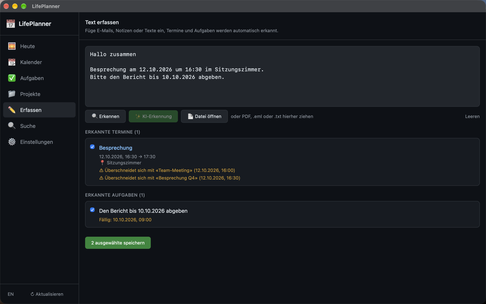

<div align="center">
  
  <h1>LifePlanner</h1>
</div>

[🇬🇧 English Version](README.md)

**Holt die Termine aus deinen Mails und PDFs, damit du sie nicht von Hand in den Kalender tippst.**

Der Termin steht in der Bestätigungsmail. Die Frist auf Seite drei eines PDFs.
Die Erinnerung ist eine Notiz, die du dir selbst geschrieben hast. Im Kalender
steht nichts davon, weil das Eintragen Handarbeit ist, die am Ende eines
Tages ansteht, der ohnehin schon zu kurz war.

LifePlanner liest diese Dateien, zieht heraus, was ein Datum trägt, und prüft
das Ergebnis gegen deinen Kalender auf Kollisionen, bevor du dich auf etwas
festlegst.

Extraktion, Kalender-Abgleich und Konflikterkennung brauchen überhaupt kein
Modell. Das optionale lokale Ollama-Briefing fasst den Tag in normalen Worten
zusammen; du kannst es ignorieren und verlierst nichts.

Alles bleibt auf dem Gerät. Es gibt weder Account noch Sync-Dienst.

**Nichts für dich, wenn** deine Termine ohnehin als Kalendereinladungen
ankommen. Dann stehen sie im Kalender, und für die Extraktion bleibt nichts
übrig.

[](https://github.com/9t29zhmwdh-coder/LifePlanner/actions) [](https://github.com/9t29zhmwdh-coder/LifePlanner/security/code-scanning) [](https://securityscorecards.dev/viewer/?uri=github.com/9t29zhmwdh-coder/LifePlanner) [](https://www.bestpractices.dev/projects/13704)

     

> **So läuft das:** LifePlanner ist eine native Desktop-App (Tauri), kein Server und kein Browser-Tab. Sie öffnet ihr eigenes Fenster wie jedes installierte Programm und läuft vollständig offline.



---

> 💾 **Download:** [macOS (DMG)](https://github.com/9t29zhmwdh-coder/LifePlanner/releases/latest/download/LifePlanner.dmg) · [Windows (Installer)](https://github.com/9t29zhmwdh-coder/LifePlanner/releases/latest/download/LifePlanner-Setup.exe) · [Linux (AppImage)](https://github.com/9t29zhmwdh-coder/LifePlanner/releases/latest/download/LifePlanner.AppImage): immer das neueste Release, nicht signiert/notarisiert (Gatekeeper/SmartScreen warnen beim ersten Start). Oder selbst aus dem Quellcode bauen, siehe Erste Schritte unten.

---

> 🌱 Neu hier? → [Schritt-für-Schritt-Anleitung für Einsteiger](GETTING_STARTED.md)

---

**In der Praxis:** Du bekommst eine native Desktop-App, die unübersichtliche E-Mails, PDFs und Notizen in einen strukturierten, konfliktgeprüften Tagesplan verwandelt. Erkennung, Kalender-Sync und Konflikterkennung funktionieren komplett ohne KI; die lokale KI-Zusammenfassung (via Ollama) ist eine optionale Ergänzung für eine Zusammenfassung in Klartext, keine Voraussetzung für die Nutzung der App.

## Funktionen

- **Erkennung mit Vorschau**: Text einfügen oder ein PDF, eine `.eml`- oder `.txt`-Datei öffnen oder hineinziehen. LifePlanner listet die gefundenen Termine und Fristen, markiert jede Überschneidung mit deinem Kalender und speichert nur, was du anhakst. Titel lassen sich vor dem Speichern korrigieren
- **Was erkannt wird**: Daten wie `12.10.2026`, `12.10.`, `2026-10-12`, heute, morgen, nächsten Montag, in 3 Tagen; Uhrzeiten wie `14:30`, gelesen als Ortszeit. PDFs brauchen eine Textebene; gescannte PDFs ohne Text werden mit einer Meldung abgelehnt, nicht gelesen
- **Kalender-Sync**: ICS-Dateien und CalDAV, nur lesend. LifePlanner übernimmt deinen Kalender und schreibt nie zurück. Abgleich in den Einstellungen; ein zweiter Abgleich aktualisiert Termine statt sie zu verdoppeln, und an der Quelle gelöschte Termine verschwinden
- **Konflikterkennung**: Überschneidungen werden in der Vorschau, im Kalender und auf der Heute-Seite markiert
- **Freie-Zeitfenster-Finder**: Zeigt, wo in deiner Arbeitszeit noch Luft ist
- **Energie-Sortierung**: Aufgaben nach Fokus / Kreativ / Routine filtern; ein Klick auf die Marke einer Aufgabe ändert Energie oder Priorität
- **Projekt-Tracker**: Aufgaben in der Aufgabenliste einem Projekt zuordnen und den Fortschritt verfolgen
- **Tages-KI-Zusammenfassung**: Lokale KI erstellt einen verständlichen Tagesüberblick
- **Volltextsuche**: SQLite-FTS5-gestützte Sofortsuche über alle Termine und Aufgaben
- **100 % Offline**: Kein Cloud-Zwang, kein Account, kein Tracking

---

## Voraussetzungen

| Komponente | Version |
|-----------|---------|
| Rust | 1.77+ |
| Node.js | 18+ |
| Tauri CLI | v2 |
| [Ollama](https://ollama.com) | aktuell (optional, für KI-Funktionen) |

**Empfohlenes Ollama-Modell:** `qwen3.5:4b`, klein genug für 8 GB Arbeitsspeicher. Jedes Instruction-Modell funktioniert; die KI-Erkennung verlangt JSON, sehr kleine Modelle scheitern daher mit einer sichtbaren Fehlermeldung statt einem Ergebnis

---

## Schnellstart

```bash
# 1. Repository klonen
git clone https://github.com/9t29zhmwdh-coder/LifePlanner.git
cd LifePlanner

# 2. Frontend-Abhängigkeiten installieren
cd frontend && npm install && cd ..

# 3. Entwicklungsmodus
cargo tauri dev

# 4. Build
cargo tauri build
```

Für KI-Funktionen [Ollama](https://ollama.com) installieren und ein Modell laden:
```bash
ollama pull qwen3.5:4b
```

Dann unter **Einstellungen → Lokale KI** die Ollama-URL eintragen.

---

## Deinstallation / Datenbereinigung

Entferne die App wie auf deinem Betriebssystem üblich (auf macOS in den Papierkorb ziehen, unter Windows "Apps & Features").

Lokale Daten werden dabei nicht automatisch entfernt: siehe [Datenschutz](#datenschutz) unten für die genauen Pfade und den Schlüsselbund-Eintrag.

---

## Datenschutz

LifePlanner wurde für vollständige Datensouveränität entwickelt:

- Alle Daten werden lokal in SQLite gespeichert: `~/Library/Application Support/LifePlanner/` (macOS), `%APPDATA%\LifePlanner\` (Windows), `~/.local/share/LifePlanner/` (Linux)
- Kalender-Zugangsdaten im OS-Schlüsselbund (macOS Keychain, Windows DPAPI), bei Bedarf manuell über Keychain Access / Credential Manager entfernbar
- KI-Verarbeitung läuft vollständig lokal via Ollama. Keine Daten verlassen das Gerät.
- Keine Analyse, kein Absturzbericht. Netzwerkverbindungen gibt es nur zu dem, was du selbst einrichtest: deinem CalDAV-Server und deinem lokalen Ollama

---

## Architektur

```
LifePlanner/
├── crates/
│   ├── lp-core/          # Kernbibliothek: Modelle, DB, Kalender-Sync, KI, Extraktoren
│   └── lp-cli/           # Optionales CLI
├── src-tauri/            # Tauri-Backend + IPC-Commands
└── frontend/             # React + TypeScript + Tailwind UI
```

**Wichtige Technologien:**
- `ical`, `quick-xml` für Dateneingabe
- `sqlx + SQLite` mit FTS5 für Speicherung und Suche
- `keyring` für sichere Zugangsdaten
- `reqwest + rustls` für CalDAV (vollständige Unterstützung lokaler Netzwerke)
- `recharts`, `zustand`, `date-fns` im Frontend

---

**Autor:** [Rafael Yilmaz](https://github.com/9t29zhmwdh-coder) · **Status:** Active ·  · **Lizenz:** MIT
