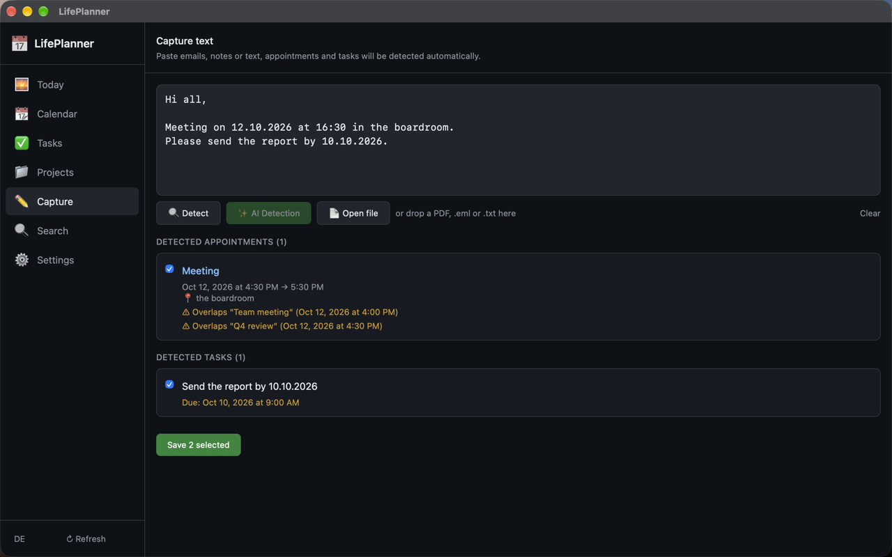

<div align="center">
  
  <h1>LifePlanner</h1>
</div>

[🇩🇪 Deutsche Version](README.de.md)

**Offline by design: AI life planner built with Rust, Tauri and local AI via Ollama.**

LifePlanner automatically recognizes appointments, tasks, projects and deadlines from emails, PDFs and notes, links them intelligently and helps you plan your day; without a single byte leaving your device.

[](https://github.com/9t29zhmwdh-coder/LifePlanner/actions)      

> **How it runs:** LifePlanner is a native desktop app (Tauri), not a server and not a browser tab. It opens its own window like any installed program and runs fully offline.



---

> 💾 **Download:** [macOS (DMG)](https://github.com/9t29zhmwdh-coder/LifePlanner/releases/latest/download/LifePlanner.dmg) · [Windows (Installer)](https://github.com/9t29zhmwdh-coder/LifePlanner/releases/latest/download/LifePlanner-Setup.exe) — always the latest release, not code-signed/notarized (Gatekeeper/SmartScreen will warn on first run). Or build from source, see Getting Started below.

---

> 🌱 New here? → [Step-by-step guide for beginners](GETTING_STARTED.md)

---

**In practice:** you get a native desktop app that turns messy emails, PDFs and notes into a structured, conflict-checked daily schedule. Extraction, calendar sync and conflict detection work without any AI at all; the local AI briefing (via Ollama) is an optional add-on for a plain-language summary, not a requirement to use the app.

## Features

- **Smart Extraction**: Paste any text (email, chat, document) and LifePlanner detects dates, deadlines and tasks automatically
- **Calendar Sync**: ICS files and CalDAV
- **Conflict Detection**: Overlapping appointments are flagged instantly
- **Free Slot Finder**: See where your day has breathing room
- **Energy Sorting**: Tasks grouped by focus / creative / routine energy level
- **Project Tracker**: Group tasks into projects with progress visualization
- **Daily AI Summary**: Local AI generates a plain-language briefing for your day
- **Full-text Search**: SQLite FTS5-powered instant search across all events and tasks
- **100% Offline**: No cloud, no account, no telemetry

---

## Requirements

| Component | Version |
|-----------|---------|
| Rust | 1.77+ |
| Node.js | 18+ |
| Tauri CLI | v2 |
| [Ollama](https://ollama.com) | latest (optional, for AI features) |

**Ollama model (recommended):** `llama3` or any instruction-tuned model

---

## Quick Start

```bash
# 1. Clone
git clone https://github.com/9t29zhmwdh-coder/LifePlanner.git
cd LifePlanner

# 2. Install frontend dependencies
cd frontend && npm install && cd ..

# 3. Development
cargo tauri dev

# 4. Build
cargo tauri build
```

To enable AI features, install [Ollama](https://ollama.com) and pull a model:
```bash
ollama pull llama3
```

Then set the Ollama URL in **Settings → Local AI**.

---

## Uninstall / Cleanup

Remove the app the usual way for your OS (drag to Trash on macOS, "Apps & Features" on Windows).

Local data is not removed automatically: see [Privacy](#privacy) below for exact paths and the OS keychain entry.

---

## Privacy

LifePlanner is designed for complete data sovereignty:

- All data stored locally in SQLite: `~/Library/Application Support/LifePlanner/` (macOS), `%APPDATA%\LifePlanner\` (Windows)
- Calendar credentials stored in the OS keychain (macOS Keychain, Windows DPAPI), removable manually via Keychain Access / Credential Manager if desired
- AI processing runs entirely on-device via Ollama. No data is sent to any server.
- No analytics, no crash reporting, no external connections

---

## Architecture

```
LifePlanner/
├── crates/
│   ├── lp-core/          # Core library: models, DB, calendar sync, AI, extractors
│   └── lp-cli/           # Optional CLI interface
├── src-tauri/            # Tauri backend + IPC commands
└── frontend/             # React + TypeScript + Tailwind UI
```

**Key technologies:**
- `sysinfo`, `ical`, `quick-xml` for data ingestion
- `sqlx + SQLite` with FTS5 for storage and search
- `keyring` for secure credential storage
- `reqwest + rustls` for CalDAV (fully local network support)
- `recharts`, `zustand`, `date-fns` on the frontend

---

**Author:** [Rafael Yilmaz](https://github.com/9t29zhmwdh-coder) · **Status:** Active ·  · **License:** MIT
